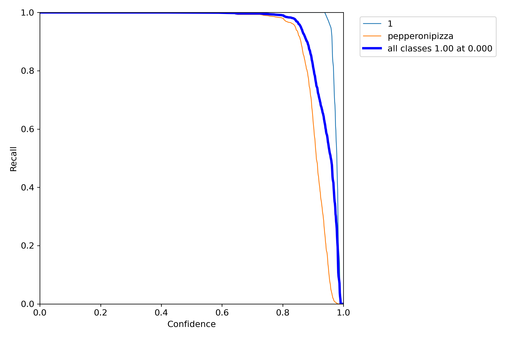

# Object Detection using YOLOv7 🚀

This repository demonstrates a complete pipeline for training and applying an object detection model using YOLOv7. It includes model training, inference on video files, result analysis, and insight extraction.

---

## 📦 Resources

- **Trained Weights:** [Download best.pt](../../releases/latest)  
- **Training Logs:** See below for detailed metrics and results  
- **Dependencies & Setup:** Refer to instructions in this README  
- **Training Environment:** AWS EC2 GPU instance – `g4dn.xlarge`

## 📁 Project Structure
```
Object_Detection_Yolov7_Project/
├── dataset/
│   └── images/
│       ├── train/
│       └── val/
|       └── test/
│   └── labels/
│       ├── train/
│       └── val/
|       └── test/
├── yolov7/
│   ├── cfg/training/
│   │   └── custom_yolov7.yaml
│   ├── data/
│   │   └── custom.yaml
│   └── yolov7.pt
├── train.txt
└── val.txt
```

## 📦 Setup Instructions

### 1. Create Python Environment (Python 3.9)

```bash
conda create -n yolov7env python=3.9
```

### 2. Activate the Environment

```bash
conda activate yolov7env
```

### 3. Install PyTorch with CUDA Support

Make sure your system supports CUDA 11.3. Install the GPU-enabled version of PyTorch:
```bash
pip install torch==1.11.0+cu113 torchvision==0.12.0+cu113 torchaudio==0.11.0 --extra-index-url https://download.pytorch.org/whl/cu113
```

## 📓 Notebook Execution

### 4. Run notebook.ipynb
- This notebook contains the end-to-end training workflow.
- Make sure to update the dataset configuration files (coco.yaml, yolov7.yaml) as needed. You can find these YAML files in the repository.
- Follow the notebook cells sequentially for training and evaluation.

## 🎥 Video Inference (Optional)

###5. Run Video-Based Inference from Notebook

Use the following command in a code cell to run inference on a video:
```bash
!python yolov7/detect.py \
  --weights runs/train/exp12/weights/best.pt \
  --source /home/ubuntu/Object_Detection_Yolov7_Project/demo_video.mp4 \
  --conf 0.25 \
  --img 640 \
  --project video_results \
  --name demo_output \
  --exist-ok
```
🔁 Note:
- Replace /home/ubuntu/Object_Detection_Yolov7_Project/demo_video.mp4 with the full path to your video file.

- Adjust --project and --name to control where the output video will be saved.

## 📈 6. Training Results

### 📊 Overall Metrics (Final Epoch)

| Metric         | Value     |
|----------------|-----------|
| **Precision**  | 0.997     |
| **Recall**     | 0.996     |
| **mAP@0.5**    | 0.997     |
| **mAP@0.5:0.95** | 0.867   |

---

### 🔍 Per-Class Performance

| Class           | Precision | Recall | mAP@0.5 | mAP@0.5:0.95 |
|------------------|-----------|--------|---------|---------------|
| **1**             | 0.993     | 1.000  | 0.995   | 0.931         |
| **pepperonipizza**| 1.000     | 0.992  | 0.998   | 0.804         |

---

### 🧠 Highlights

- 📈 **mAP@0.5 improved** from 0.235 to 0.997 over 25 epochs.
- ⚡ **Early convergence** observed around epoch 10.
- ✅ **No overfitting** was observed throughout training.

## 📊 7. Results Visualization and Analysis

#### 1. Training & Validation Metrics


- Box / Objectness / Classification Loss (Train & Val): Consistently decreasing trends, indicating stable model convergence. Minimal overfitting as validation losses follow training losses closely.
- Precision / Recall: Both reach near 1.0 quickly and remain stable, demonstrating highly accurate predictions.
- mAP@0.5 and mAP@0.5:0.95: Show a steady improvement, indicating that the model generalizes well across different IoU thresholds.

#### 2. F1 Score vs Confidence


- Peak F1 Score at ~0.73 Confidence: The model achieves optimal balance between precision and recall at this threshold.
- Smooth Curve: Minimal fluctuation across classes, suggesting consistent model behavior and low variance across predictions.

#### 3. Precision vs Confidence


- Precision Remains High: Above 90% across almost the full range of confidence scores.
- Low False Positives: Indicates the model is conservative with predictions, leading to fewer incorrect detections.

#### 4. Recall vs Confidence


- Recall Close to 1.0: Even at lower confidence levels, the model identifies most true objects.
- Drop-off at High Confidence: Typical in object detection, as stricter confidence thresholds reduce recall.

#### 5. Precision vs Recall (PR Curve)


- Near-Perfect Curve: All classes lie very close to the top-right corner indicating excellent precision-recall tradeoff.
- mAP@0.5 ≈ 0.997: Confirms high performance of the model during evaluation.

## 🔎 8. Inference Video Insights

[](https://raw.githubusercontent.com/Aashutoshh01/Yolov7_Object_Detection/main/Results/demo.mpy)
- The model detects pizza slices accurately under varied lighting and backgrounds.
- Real-time inference was smooth and robust.
- Occasional misdetections occurred only at extreme occlusions.

## 🧠 9. Conclusion
## 📜 10. License

Open-source for learning purposes. Use and modify freely.
- This work is built using YOLOv7.
- CUDA acceleration used for training and inference.
